# LOAD BALANCER SOLUTION WITH NGINX AND SSL/TLS

## Project Task Architecture
This project consists of two parts:

1. Configure Nginx as a Load Balancer
2. Register a new domain name and configure secured connection using SSL/TLS certificates

The target architecture for this project looks like this:


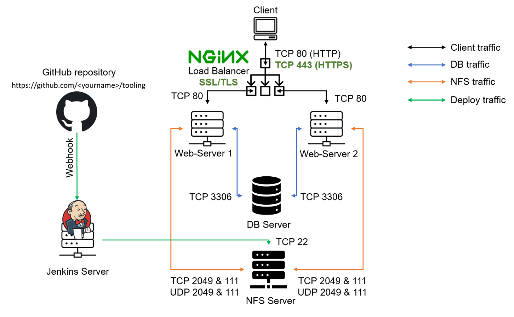


## Step 1 – CONFIGURE NGINX AS A LOAD BALANCER


* Spin up an EC2 Ubuntu 20.04 LTS based VM and named it LB-nginX with TCP port 80 and 443 opened for incoming traffic
* Updated /etc/hosts file 

`sudo vi /etc/hosts`

```
<WebServer1-Private-IP-Address> Web1
<WebServer1-Private-IP-Address> Web1
```

* Installed Nginx as LB to point traffic to the resolvable DNS names of the webservers


```
sudo apt update
sudo apt install nginx
```

Configure Nginx LB using Web Servers’ names defined in `/etc/hosts`

```
upstream myproject {
    server Web1 weight=5;
    server Web2 weight=5;
  }

server {
    listen 80;
    server_name www.domain.com;
    location / {
      proxy_pass http://myproject;
    }
  }

#comment out this line
#       include /etc/nginx/sites-enabled/*;
```

***server (webserver1 IP address);***

***server (webserver2 IP address);***


* Restart Nginx and make sure the service is up and running

```
sudo systemctl restart nginx
sudo systemctl status nginx
```

**Can also ensure Nginx stays active after reboot/restart**

`sudo systemctl enable nginx`


## REGISTER A NEW DOMAIN NAME AND CONFIGURE SECURED CONNECTION USING SSL/TLS CERTIFICATES

1. I registered a new domain name with from Route 53 service and this created a hosted zone for the Domain name which I confirmed as below:


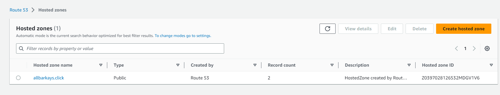

2. Created two A records "allbarkays.click" and "www.allbarkays.click" using the public IP address of the  Nginx LB server


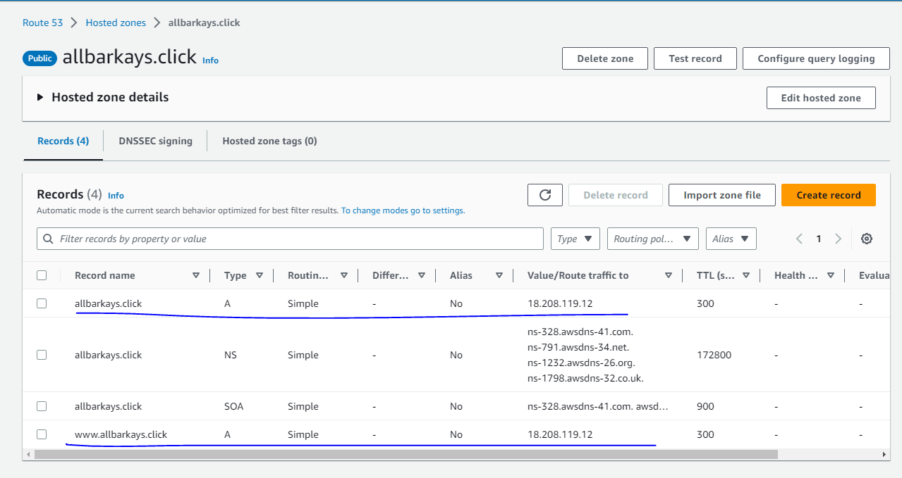


3. Now we have the LB, Route 53 and the Domain name all connected, so I confirmed the NginX server was reachable from the browser before the next step in 4 below:

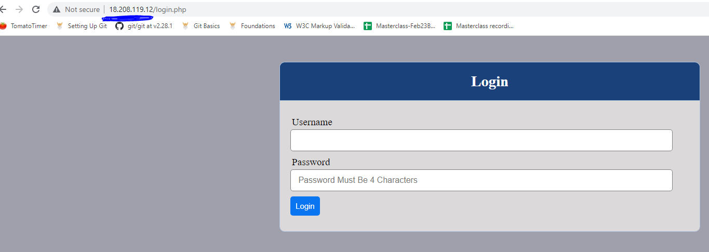


4. Then, configured Nginx to recognize the new domain name

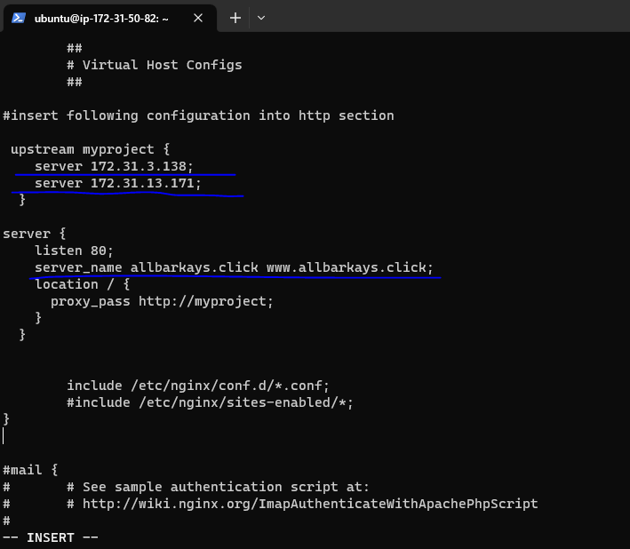

5. And confirmed the domain is reachable from browser, however, it is not secured as reflected in the image below:

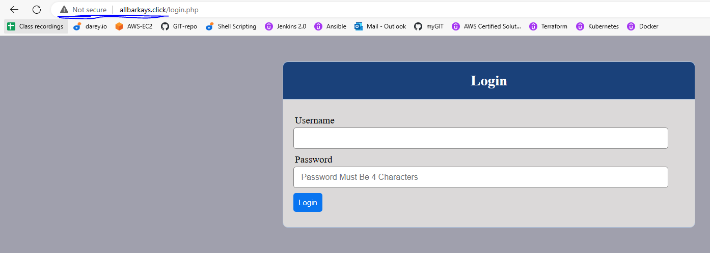


5. Install certbot and request for an SSL/TLS certificate

* Ensure snapd service is active and running with: `sudo systemctl status snapd`


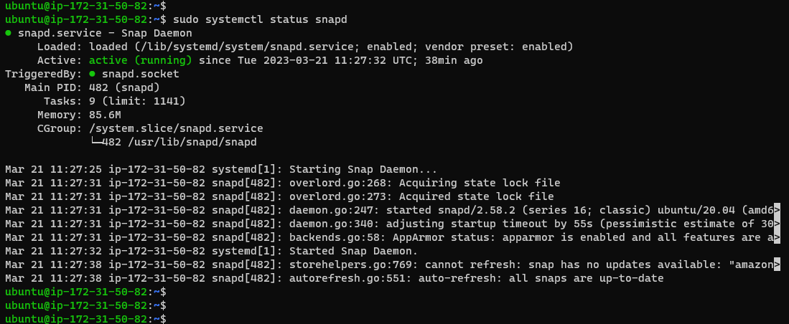


* Install Certbot


`sudo snap install --classic certbot`

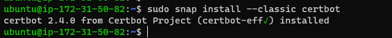


* Using the code below, request my certificate and follow the instructions.

```
sudo ln -s /snap/bin/certbot /usr/bin/certbot
sudo certbot --nginx
```
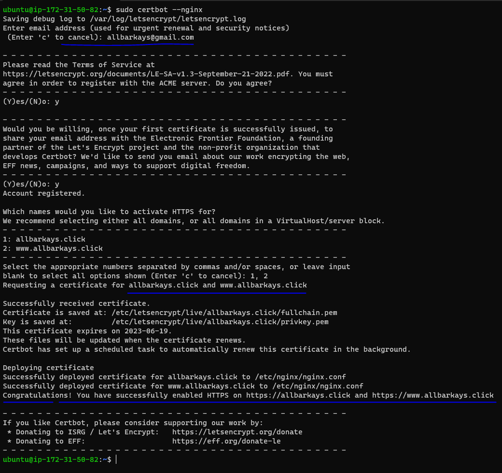


* onnection now secured via ***https*** as seen below:

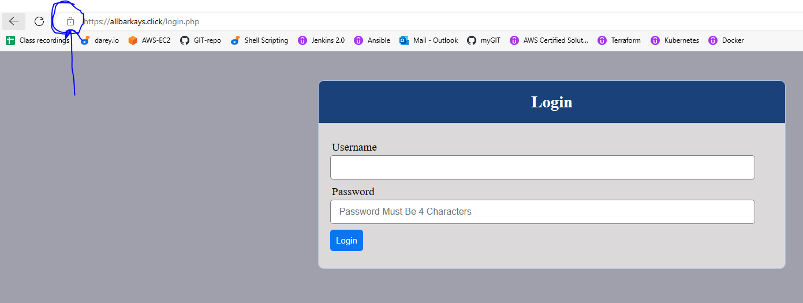


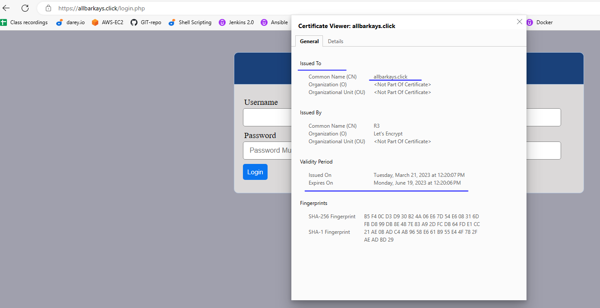


6. Set up periodical renewal of your SSL/TLS certificate

By default, LetsEncrypt certificate is valid for 90 days, so it is recommended to renew it at least every 60 days or more frequently.

We could test renewal command in dry-run mode

`sudo certbot renew --dry-run`


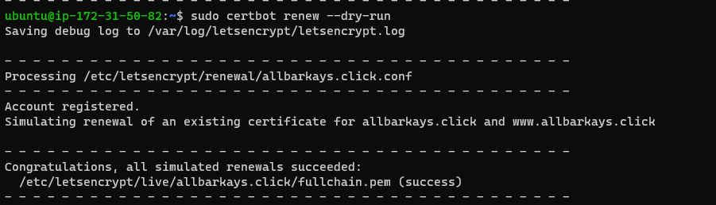


* However, the best pracice is to have a scheduled job that to run renew command periodically. Let us configure a ***cronjob*** to run the command twice a day.

To do this, lets edit the ***crontab file*** with the following command:


`crontab -e`

Add following line:

`* */12 * * *   root /usr/bin/certbot renew > /dev/null 2>&1`


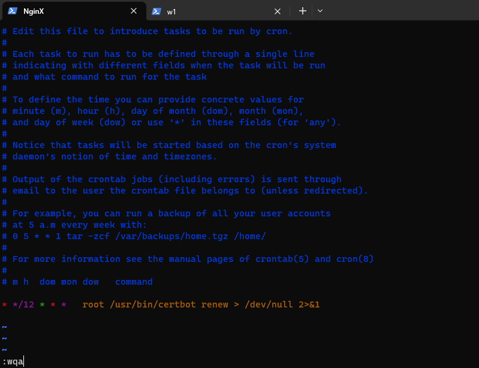


With the aid of the documentation, I have just implemented an Nginx Load Balancing Web Solution with secured HTTPS connection with periodically updated SSL/TLS certificates.


